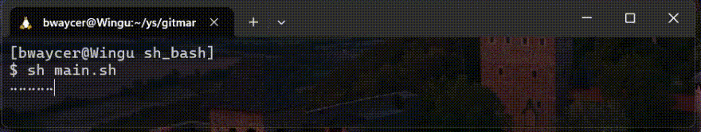

本微波
=======

> 授權： [CC0-1.0](https://choosealicense.com/licenses/cc0-1.0/)

> 版本： v0.1.0

進階版的「你好，世界」，希望能幫助您習慣一門新語言。

(邏輯作法建議參考 [虛擬程式碼](./looseLeaf/pseudocode.txt)。)

## 範本

* [golang.go](./src/go_golang/main.go)
* [node.js](./src/js_node/main.js)
* [python.py](./src/py_python/main.py)
* [bash.sh](./src/sh_bash/main.sh)

